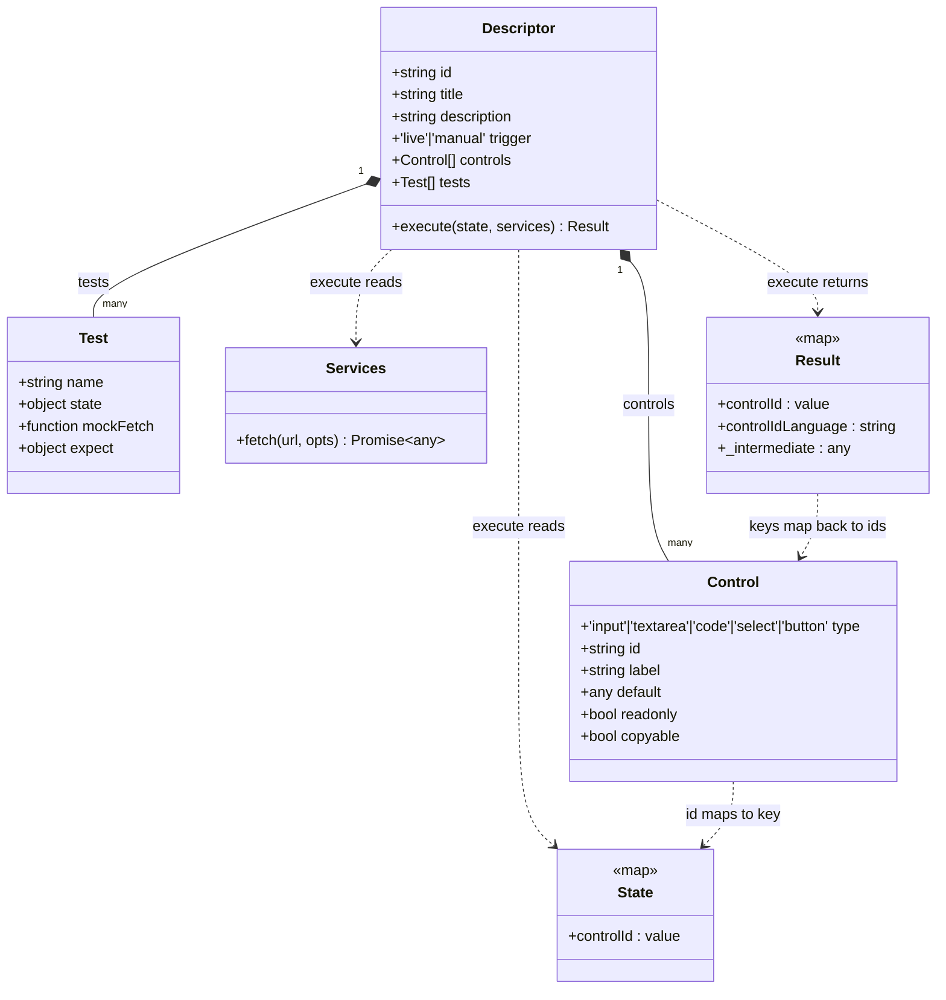
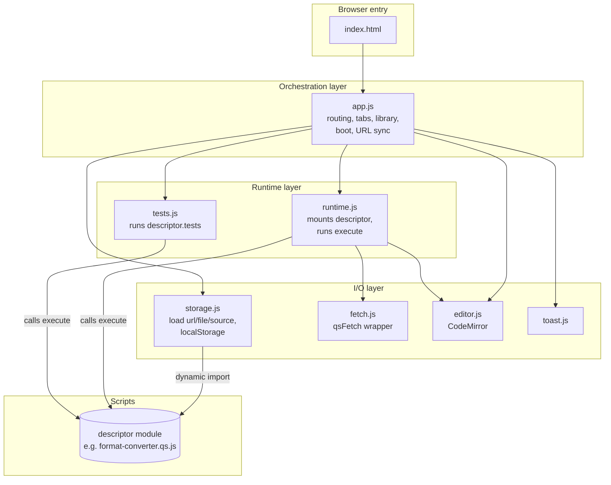
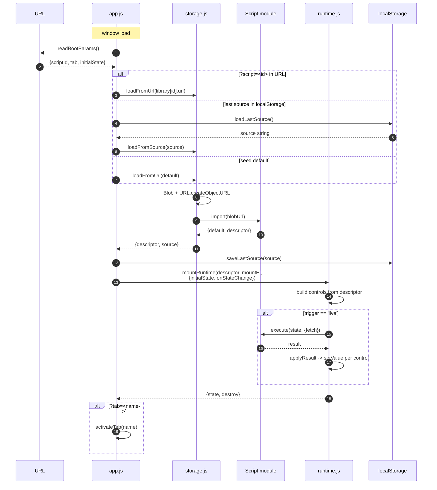
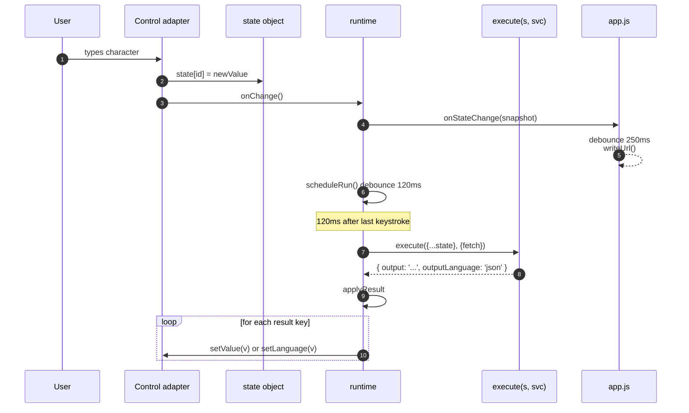
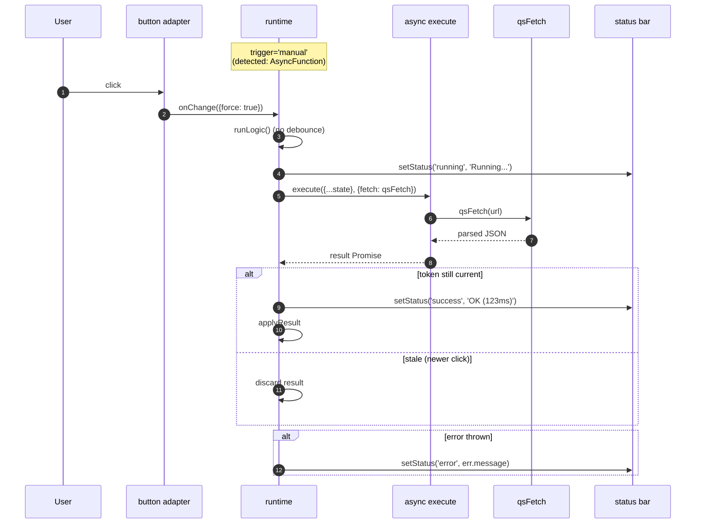
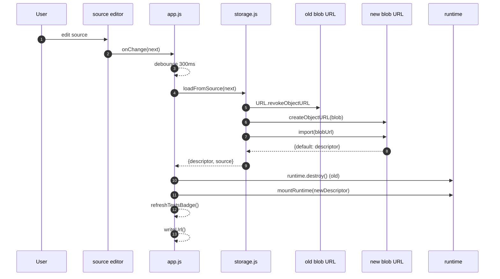
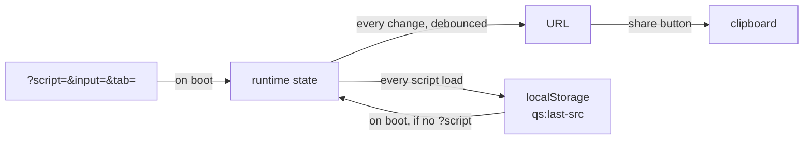
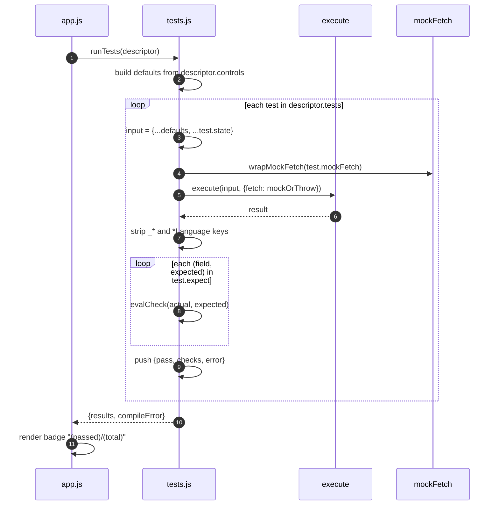

# QuickScripts - Architecture

> Companion to `AGENTS.md`. `AGENTS.md` is the "how do I work in this codebase" doc; this is the "what is the system actually doing under the hood" doc. Diagrams in Mermaid so they render in GitHub, in Hugo (with the Blowfish mermaid shortcode), and in any markdown previewer.

## TL;DR

QuickScripts is a tiny browser-only IDE at `/qs/`. A "script" is a plain ES module that exports a **descriptor** - a data object describing UI controls plus a pure `execute(state, services)` function. The runtime turns the descriptor into a live UI: it mounts controls, snapshots their state on every change, calls `execute`, and writes the returned values back into controls. No build step, no server.

The whole system has five collaborating modules and one well-defined data shape (the descriptor). Once that shape clicks, the rest follows.

## 1. The data model

The descriptor is the spine. Everything else is machinery around it.

Two invariants worth committing to memory:

1. **Control `id` ↔ State key ↔ Result key** are the same string. That's the contract - it's what makes the runtime able to be fully generic.
2. **`execute` is pure**. It gets a snapshot of state, returns a plain object. No DOM, no globals, no hidden state. This is the property that makes scripts portable, testable, and serializable.

## 2. Component layout

Five JS modules, one HTML entry, two seed scripts. `app.js` is the only orchestrator; everyone else is a focused utility.

Notes:

- **`storage.js` owns module loading.** It turns a URL or a string of source code into a parsed descriptor via `Blob` + `import()`. That single trick is what lets the Code tab live-edit a script with no build step.
- **`runtime.js` is the only place that touches user-facing controls** during a session. `app.js` mounts it once per descriptor swap, then steps back.
- **`tests.js` doesn't touch the runtime.** It calls `execute` directly with synthesized state and a mock `fetch`. The Tests tab is essentially a parallel headless runtime.
- **`fetch.js` exists so scripts never see `Response` objects.** It hands back parsed JSON or throws a clean `Error` - removes a whole class of "did you call .json()" boilerplate from script authors.

## 3. Lifecycle: page boot

The boot path resolves which script to load and feeds initial state from the URL if present.

Two design choices worth flagging:

- **Three-layer fallback (URL → localStorage → seed)** means a returning user lands back in their last edited script even without a bookmark. The URL still wins so shared links are deterministic.
- **`pendingInitialState`** is a one-shot variable on `app.js`. It's consumed by the next `mountRuntime` call so URL-supplied state survives the script-load round trip but doesn't leak into subsequent script swaps.

## 4. Lifecycle: a keystroke (live trigger)

The hot path. Almost every interaction goes through this loop.

Subtleties:

- **State is mutated in place by adapters, then spread into `execute`.** The spread is the boundary that guarantees `execute` can't mutate runtime state through aliasing.
- **Two debounces, different jobs.** The 120ms `scheduleRun` debounce coalesces rapid keystrokes into a single `execute` call. The 250ms `writeUrl` debounce keeps `history.replaceState` calls cheap. They're independent on purpose - the URL doesn't have to settle before the preview updates.
- **`runToken` (in `runtime.js`)** is incremented on every run. An async `execute` checks the token before applying its result; if a newer run has started, the stale result is discarded. This is the same trick React uses for race-safe data fetching.

## 5. Lifecycle: manual trigger (button + async)

When `execute` is async (e.g. hits an API), live mode would fire a request per keystroke. The runtime detects async functions and switches to manual.

`qsFetch` adds three things vanilla `fetch` doesn't:

1. **10s default `AbortController` timeout.**
2. **Auto JSON parse with text fallback.** Returns `data` directly, never a `Response`.
3. **Errors carry HTTP status + server message.** `throw new Error('HTTP 404 Not Found - <body excerpt>')`.

## 6. Lifecycle: editing the source

The Code tab edits the raw `.qs.js` source. Every change re-imports the module on the fly.

Why this works:

- Each edit produces a fresh blob URL, so `import()` actually re-evaluates the module (`import()` caches by URL).
- The previous blob URL is revoked, so memory doesn't leak across edits.
- The old runtime is `destroy()`-ed before the new one mounts. Adapters detach their listeners; pending timers are cancelled; `runToken` is bumped so any in-flight `execute` becomes stale.
- A syntax error during import sets the inline error label and leaves the previous descriptor running. The UI doesn't blank out on every typo.

## 7. State, URL, and storage

Three places state can live. The rules for which one wins, in order:

- **URL is the source of truth for sharing.** Open a link, you get the exact same script and exact same control values.
- **`localStorage` is for "pick up where I left off."** Stores only the source; control values are not persisted across reloads unless they're in the URL.
- **Run state is ephemeral.** It lives in the closure of `mountRuntime` and dies when the runtime is destroyed.

## 8. Tests pipeline

Tests run against the descriptor, not the mounted UI. They share the `execute` function with the runtime, which is what makes them meaningful.

`evalCheck` understands three matchers: deep equal (default), `{ contains: 'substr' }`, `{ regex: /.../ }`. Anything else is treated as a deep-equal target. The matcher dispatches on shape, not on a `kind` field - keeps the tests-as-data syntax light.

## 9. Where the seams are

If you wanted to extend the system, these are the natural extension points and what they'd cost:

| Extension | Where it goes | Cost |
|---|---|---|
| New control type | `mkAdapter` switch in `runtime.js` + style hooks | ~30 LOC + CSS |
| New test matcher | `evalCheck` in `tests.js` | ~5 LOC |
| Persist control values across reloads | `saveLastSource` is a sibling - add `saveLastState` keyed by descriptor id | ~10 LOC |
| Cross-script chaining | The `_*` keys in `Result` are reserved for this; would need a registry in `app.js` | nontrivial |
| TypeScript scripts | Either pre-compile to JS before save, or swap `loadFromSource`'s `import()` for a transform pipeline | substantial - breaks "no build step" |

## 10. Things this design deliberately doesn't do

- **No cross-script communication.** Each descriptor is loaded into its own blob URL and runs in isolation. Two scripts open in two tabs share nothing.
- **No DOM access from `execute`.** The function is pure data-in / data-out. Anything DOM-shaped (drag, drop, focus) would need a new control type and adapter, not an escape hatch.
- **No bundling.** Scripts ship as readable source that the browser executes verbatim. The Code tab is the primary editor; "Save" hands you back the same file you'd commit to the repo.
- **No persistent execution state between runs.** Every `execute` call gets a fresh snapshot. Long-running state would have to be modeled as control values, which forces it to be visible.

These are the load-bearing constraints. Loosening any of them would buy capability but would also change what the system *is*.
